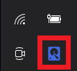

# KeepDrivesAlive
This is an alternative programme (and rather simplified one) to [this](https://github.com/stsrki/KeepAliveHD), which is used to thwart the undesired power-saving/standby mode automatically activated by your external hard-drive controller.

## Rationale
Although the existing measure based on periodic file-writing requests that trick drives into staying responsive works very well, it has been observed that my old external drive incurred a noticeable number of seeking workloads as a result. A solution which fulfills the same purpose but imposes fewer such burdens would be better for its health and longevity, and this programme is my attempt to achieve that goal.

## Features
To reduce the overheads, a different approach has been taken highlighting the following designs
1. Instead of file-writing, an IO-control command, [IOCTL_DISK_UPDATE_PROPERTIES](https://docs.microsoft.com/en-us/windows/win32/api/winioctl/ni-winioctl-ioctl_disk_update_properties), is utilised to nudge drives. Note that with this command drives themselves are targeted directly; thus the partitions within as well as the corresponding file systems should be barely touched in response to it.
2. The nudge call (the IOCTL_DISK_UPDATE_PROPERTIES command) is only given to a drive when it is deemed *inactive*, which is determined via the monitoring of its read/write counts obtained through another IO-control command, [IOCTL_DISK_PERFORMANCE](https://docs.microsoft.com/en-us/windows/win32/api/winioctl/ni-winioctl-ioctl_disk_performance).

## Caveats
1. The efficiency claim above is merely based on my subjective judgement and personal observation. No quantitative comparisons or measurements have been conducted to support my assertion.
2. It is unclear that whether or not the use of the IOCTL_DISK_UPDATE_PROPERTIES command to keep drives active is feasible across various external controllers, as its intended function described on Microsfot Docs is to "invalidates the cached partition table and re-enumerates the device."

## Build Environment
Microsoft Visual Studio 2013, Update 4. Newer versions should also work, presumably.

## Install
Just moving both the executable (KeepDrivesAlive.exe) and the config file (KeepDrivesAlive.exe.Config) together to whatever location preferred.

Additionally, one can make it a start-up programme by editing Windows Registry, adding the path to the executable as a string value to
> HKEY_CURRENT_USER\Software\Microsoft\Windows\CurrentVersion\Run

or 
> HKEY_LOCAL_MACHINE\Software\Microsoft\Windows\CurrentVersion\Run

## Usage
Once the programme has started (either through double-clicking it or automatically) and begun monitoring your drives, a notification icon of a blue disk can be found appearing in the windows taskbar. \
 \
By right-clicking on that icon pops up a menu which allows users to control/examine its behaviour.

To configure, click "Settings" and edit the monitoring rules.

To check which drives are currently being monitored based on the given rules, click "Monitor".

To terminate the entire programme, click "Exit".

